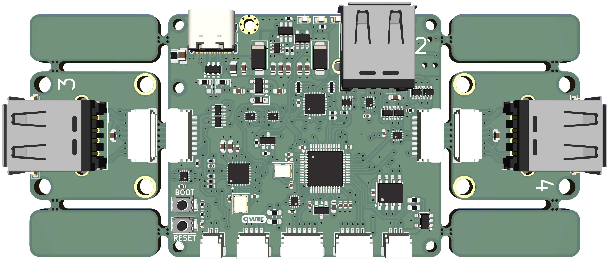

# UDK Module - STM32F474 *(with 4-Port hub)*

**Keyboard MCU**

- *Refer to https://github.com/tecsmith/udk for information on the **Universal Design Keyboards** (UDK) - MCU Modules*

# Featuring

- `STM32G474`
- `CH334` (3-ports exposed as USB-A receptacles)
